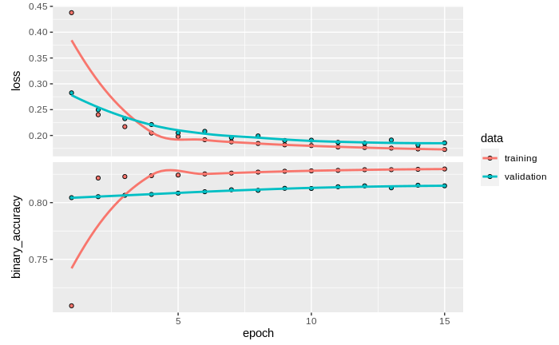
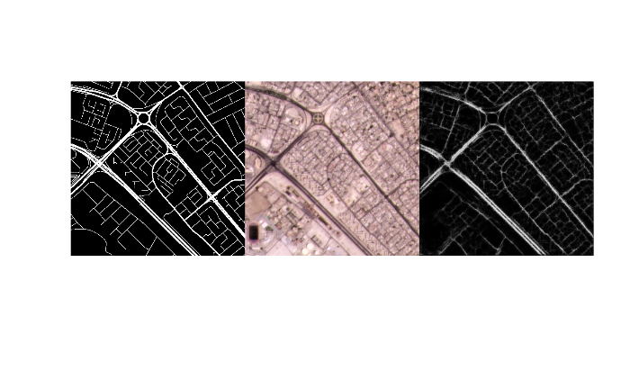

```{r standardize output, include=FALSE}
library(knitr)
opts_chunk$set(message=FALSE, warning=FALSE, echo=TRUE, fig.width = 7, fig.height = 7, fig.align = "center")
```

```{r env, message=FALSE, include=FALSE, results=F}
# used libraries
library(keras)
library(tensorflow)
library(tfdatasets)
library(purrr)
library(ggplot2)
library(rsample)
library(stars)
library(terra)
library(raster)
library(reticulate)
library(mapview)
library(dplyr)
```

# Introduction

This report aims to show the process of exploring the sustainability of convolutional neural networks (CNNS). The subject of infrastructure growth due to the World Cup 2022 has been chosen to take up a topic that is currently being discussed in society  and to arouse interest in the topic of the growing infrastructure around a World Cup. 

But also to show which methods, in this case deep learning, can be used to produce well-founded results that one can rely on.
Growth of infrastructure is a broad spectrum, because under the term infrastructure the most diverse elements are collected . Therefore, it needed a specification here. The specification of road growth was chosen because it is one of the most illustrative examples, which is close to the reality of life of many people.

Topics that are discussed in society in regard to the world cup 2022 and are interesting for infrastructure growth can be clustered under the top themes of sustainability and violation of human rights. 

There is a broad discussion about the growth of infrastructure at almost every major sporting event (European Championship, World Cup, Olympics). This is also the case at various world championships. In order for a country to host a World Cup, there are various guidelines that must be followed. Most countries, however, do not meet these guidelines and have to present plans that show that they will have a suitable infrastructure, e.g. stadiums, hotels, by the start of the World Cup. In the case of the 2022 World Cup in Qatar, this means that since the announcement of the 2022 World Cup in Qatar, a massive expansion of infrastructure has been and is being driven forward. It can be seen that some stadiums are only built for the World Cup 2022 [@Stern]. Furthermore a new airport and other infrastructure like hotels and public transport systems can be found [@Stern]. For that reason there is a huge discussion  on the sustainability of the World Cup in Qatar. Many have the opinion that stadiums that are only built for the World Cup and are no longer used afterwards do not correspond to the sense of sustainable use [@Stern]. Also the operation of the stadiums is criticized, since this e.g. by the cooling in this hot region, releases much energy [@kicker]. This type of discussion is becoming even more important as Qatar has made a promise to hold the 2022 World Cup in a climate-neutral manner [@tz]. Another discussion, which is particularly important in relation to the development of infrastructure is the way in which the infrastructure is built and by whom. A huge exploitation of guest workers in several branches can be found since 2011 in Qatar [@benjaminBest]. According to research by Amnesty International more than 6500 guest workers have died in Qatar since the World Cup was awarded in 2011 [@TheGuardian.2021].  But the number of unreported cases seems to be even higher [@TheGuardian.2021].

In order to be able to provide a further basis for the discussion on the expansion of the infrastructure, this report refers to street growth. As this process is scientifically measurable. Furthermore street growth is important for infrastructure and networks and could be seen as an indicator for growth. 
Therefore high-resolution satellite imagery from nano satellites was analyzed and classified to answer the question of:

How does the street infrastructure around the Khalifa International Stadium change from 2017 on according to the Soccer World cup in 2022?
 
This report shows the different steps that were necessary to answer the question. 
The first part focuses on the project goals. The second part provides an overview about the used methods. After that results are presented and discussed. Part four focuses on lessons learned, followed by a section highlighting how the project was planned and implemented.

# Project Goal
The aim of this project was the detection of streets around the Khalifa International Stadium  and how it changed  from 2017 on according to the Soccer World Cup in 2022. Therefore several classification methods and challenges associated with them should be learned. Since the project is based on convolutional neural networks with *keras* and *tensorflow* the aim was to understand the key steps when using deep learning in remote sensing. Also because large amounts of data are used in this context it was necessary to learn how to use an *AWS*. This is linked to the challenges coming up when dealing with huge datasets. 


Since a model was build the goal was to understand how to built, train and predict with it. The aim was to understand how to set up a model and furthermore to understand which validation methods are suitable for a good prediction. As an overarching goal the understanding of a deep learning factor must be mentioned.

# Methods

## Data

### Nano Satellite Images
The images used for model training and prediction were created by nano satellites from Planet [@PlanetTeam.2017] and are provided by them as *PSScene3Band* products, which have a spatial resolution of 3 x 3 meter. We used a spatial extent located in Bahrain to train the image. The image is a visual product from the 28th of April, 2021 (see Figure 1). 

For prediction and comparison we used images around the Khalifa International Stadium, Doha (Qatar) every two years from 2017. To exclude seasonal irregularities we stuck to images of March and April (2017-04-22, 2019-03-27, 2021-03-18). In Figure 2 the image of 2021 is plotted.

### Street Network Vectors
To create masks for model training we obtained OpenStreetMap shapefiles of the states from the Gulf Cooperation Council (GCC) from *Geofabrik* [@OpenStreetMap]. The data can be downloaded via http://download.geofabrik.de/asia/gcc-states-latest-free.shp.zip. One of the provided shapefiles contains data about the street network (gis_osm_roads_free_1.shp), which we clipped to the spatial extent of our Bahrain training image via QGIS [@QGISDevelopmentTeam.2021].

## Preprocesssing
Planet assigns not available pixel values with 0, which impedes combining images. Before merging images, we therefore assigned pixel values of 0 with NA values for each image. Because the nano satellite images of each year consist of multiple images from different swaths, we then merged single images to have one image covering the entire spatial extent of one year.

```{r function to preprocess satellite tiles}
# Preprocess satellite images
setNAs <- function(test_tile){
  # set zero values to NA
  test_tile[test_tile[]==0] <- NA
  # crop to non NA values
  test_tile = trim(test_tile)
  # remove fourth band (NIR)
  test_tile = dropLayer(test_tile,4)
  return (test_tile)
  }
```

```{r merge single raster images}
# Set path to folder containing Planet satellite images of Bahrain
if(!file.exists("data/training_unet/bahrain_2021.tif")){
  setwd("data/Bahrain_2021_3Band/files")
  files = list.files(pattern = ".tif$")
  filesList = as.list(files)
  stackList = lapply(filesList, stack)
  stackList = lapply(stackList, setNAs)
  mosaic_bahrain = mosaic(stackList[[1]],stackList[[2]],stackList[[3]], stackList[[4]],
                          fun = mean)
  setwd("~/")
  writeRaster(mosaic_bahrain, "data/training_unet/bahrain_2021.tif")
}


if(!file.exists("data/testarea_unet/doha_2021.tif")){
  setwd("data/2021/files")
  files = list.files(pattern = ".tif$")
  filesList = as.list(files)
  stackList = lapply(filesList, stack)
  stackList = lapply(stackList, setNAs)
  mosaic_doha21 = mosaic(stackList[[1]],stackList[[2]],fun = mean)
  setwd("~/")
  writeRaster(mosaic_doha21, "data/testarea_unet/doha_2021.tif")
}

if(!file.exists("data/testarea_unet/doha_2019.tif")){
  setwd("data/2019/files")
  files = list.files(pattern = ".tif$")
  filesList = as.list(files)
  stackList = lapply(filesList, stack)
  stackList = lapply(stackList, setNAs)
  mosaic_doha19 = mosaic(stackList[[1]],stackList[[2]],fun = mean)
  setwd("~/")
  writeRaster(mosaic_doha19, "data/testarea_unet/doha_2019.tif")
}

if(!file.exists("data/testarea_unet/doha_2017.tif")){
  setwd("data/2017/files")
  files = list.files(pattern = ".tif$")
  filesList = as.list(files)
  stackList = lapply(filesList, stack)
  stackList = lapply(stackList, setNAs)
  mosaic_doha17 = mosaic(stackList[[1]],stackList[[2]],fun = mean)
  setwd("~/")
  writeRaster(mosaic_doha17, "data/testarea_unet/doha_2017.tif")
}
```

```{r plot of Bahrain, eval = TRUE, echo=FALSE, fig.cap= "Training area in Bahrain (2021)"}
plotRGB(stack("data/Bahrain_2021_3Band/bahrain_2021.tif"), main="Bahrain")
```

```{r plot doha rgb, eval = T, echo = F, fig.height = 4, fig.cap= "Test area in Doha (2021)"}
plotRGB(stack("data/testarea_unet/doha_2021.tif"), main="Bahrain")
```

To obtain accurate masks of the street network, a buffer was applied on the main roads according to their feature class. The buffer size depended on the importance of the road, from trunk roads with buffer size of 6 cells to tertiary roads with buffer size of 3 cells. After that the vector file was rasterized. 

```{r create street mask}
if(!file.exists("data/testarea_unet/street_mask.tif")){
  # Preprocess street shapefile
  # load planet image of train area
  st_bahrain = stack("data/training_unet/bahrain_2021.tif")
  # load openstreetmap data of the streets
  streets_all = read_sf("data/shp/streets_osm.shp")
  # transform osm data to crs of bahrain image
  streets_utm = st_transform(streets_all, crs = crs(st_bahrain))
  # crop shp to satellite image
  streets = st_crop(streets_utm, st_bbox(st_bahrain))
  
  # Rasterize streets shapefile
  # creates a SpatVector object
  v_lines = vect(streets)
  # prepare the output raster size
  r = rast(v_lines, ncol = ncol(st_bahrain), nrow = nrow(st_bahrain))
  # first raster, where each street type has the same width
  x <- rasterize(v_lines, r, touches = TRUE, background = 0)
  
  # Buffer streets to get better rasterization result, because main roads have a higher width
  primaries = streets[streets$fclass == "primary",]
  secondaries = streets[streets$fclass == "secondary",]
  tertiaries = streets[streets$fclass == "tertiary",]
  trunks = streets[streets$fclass == "trunk",]
  
  poly_streets = rbind(primaries,secondaries, tertiaries, trunks)
  
  st_geometry(poly_streets[poly_streets$fclass == "trunk",]) = st_geometry(
    st_buffer(trunks, dist = 6))
  st_geometry(poly_streets[poly_streets$fclass == "primary",]) = st_geometry(
    st_buffer(primaries, dist = 5))
  st_geometry(poly_streets[poly_streets$fclass == "secondary",]) = st_geometry(
    st_buffer(secondaries, dist = 4))
  st_geometry(poly_streets[poly_streets$fclass == "tertiary",]) = st_geometry(
    st_buffer(tertiaries, dist = 3))
  
  # second raster with the bis streets
  v_poly = vect(poly_streets)
  r_poly = rast(v_poly, ncol = ncol(st_bahrain), nrow = nrow(st_bahrain), extent = ext(x))
  x_poly <- rasterize(v_poly, r_poly, touches = TRUE, background = 0)
  # Combine resulting two raster layers
  result = max(x_poly,x)
  writeRaster(result, "data/training_unet/street_mask.tif", overwrite = TRUE)
}
```

The white areas in Figure 3. show the streets (TRUE) while black areas represent no streets (FALSE). Bigger streets have a bigger size than smaller streets due to their respective buffers.

```{r plot street mask, eval = T, echo = F, fig.cap= "Street mask"}
plot(stack("data/training_unet/street_mask.tif"), col=c("white","black"), axes=FALSE)
```

## Model Building
The model building workflow follows the pixel-by-pixel classification part of the tutorial “Introduction to Deep Learning in R for the Analysis of UAV-based Remote Sensing Data“ by Christian Knoth. This allows for the localisation of desired features in a target image based on a U-net architecture [@OlafRonneberger.2015]. The architecture consists of two parts. The first part is the contracting path, which extracts spatial patterns and is made of convolutional and max pooling layers. In the second part, the expansive path, the maps of spatial patterns are resampled back to the resolution of the input image by convolutional and upsampling layers combined with concatenated layers of the original patterns.

```{r simple_Unet}
if(!file.exists("pretrained_unet.h5")){
  ## Pixelwise classification of streets in Doha, Qatar
  ## From image to pixel-by-pixel classification
  
  ## we start with the "contratcing path"##
  # input
  input_tensor <- layer_input(shape = c(448,448,3))
  
  #conv block 1
  unet_tensor <- layer_conv_2d(input_tensor,filters = 64,kernel_size = c(3,3),
                               padding = "same",activation = "relu")
  conc_tensor2 <- layer_conv_2d(unet_tensor,filters = 64,kernel_size = c(3,3), 
                                padding = "same",activation = "relu")
  unet_tensor <- layer_max_pooling_2d(conc_tensor2)
  
  #conv block 2
  unet_tensor <- layer_conv_2d(unet_tensor,filters = 128,kernel_size = c(3,3), 
                               padding = "same",activation = "relu")
  conc_tensor1 <- layer_conv_2d(unet_tensor,filters = 128,kernel_size = c(3,3), 
                                padding = "same",activation = "relu")
  unet_tensor <- layer_max_pooling_2d(conc_tensor1)
  
  #"bottom curve" of unet
  unet_tensor <- layer_conv_2d(unet_tensor,filters = 256,kernel_size = c(3,3), 
                               padding = "same",activation = "relu")
  unet_tensor <- layer_conv_2d(unet_tensor,filters = 256,kernel_size = c(3,3), 
                               padding = "same",activation = "relu")
  
  ##  this is where the expanding path begins ##
  
  # upsampling block 1
  unet_tensor <- layer_conv_2d_transpose(unet_tensor,filters = 128,kernel_size = c(2,2)
                                         ,strides = 2,padding = "same")
  unet_tensor <- layer_concatenate(list(conc_tensor1,unet_tensor))
  unet_tensor <- layer_conv_2d(unet_tensor, filters = 128, kernel_size = c(3,3),
                               padding = "same", activation = "relu")
  unet_tensor <- layer_conv_2d(unet_tensor, filters = 128, kernel_size = c(3,3),
                               padding = "same", activation = "relu")
  
  # upsampling block 2
  unet_tensor <- layer_conv_2d_transpose(unet_tensor,filters = 64,kernel_size = c(2,2),
                                         strides = 2,padding = "same")
  unet_tensor <- layer_concatenate(list(conc_tensor2,unet_tensor))
  unet_tensor <- layer_conv_2d(unet_tensor, filters = 64, kernel_size = c(3,3),
                               padding = "same", activation = "relu")
  unet_tensor <- layer_conv_2d(unet_tensor, filters = 64, kernel_size = c(3,3),
                               padding = "same", activation = "relu")
  
  # output
  unet_tensor <- layer_conv_2d(unet_tensor,filters = 1,kernel_size = 1, 
                               activation = "sigmoid")
  
  # combine final unet_tensor (carrying all the transformations applied through the layers)
  # with input_tensor to create model
  unet_model <- keras_model(inputs = input_tensor, outputs = unet_tensor)
}
```

```{r pretrained_unet}
if(!file.exists("pretrained_unet.h5")){
  
  ## load pretrained vgg16 and use part of it as contracting path (feature extraction) ##
  vgg16_feat_extr <- application_vgg16(weights = "imagenet", include_top = FALSE, 
                                       input_shape = c (448,448,3))
  
  # optionally freeze first layers to prevent changing of their weights, 
  # either whole convbase or only certain layers
  # freeze_weights(vgg16_feat_extr) #or:
  # freeze_weights(vgg16_feat_extr, to = "block1_pool")
  
  # we'll not use the whole model but only up to layer 15
  unet_tensor <- vgg16_feat_extr$layers[[15]]$output
  
  ## add the second part of 'U' for segemntation ##
  
  # "bottom curve" of U-net
  unet_tensor <- layer_conv_2d(unet_tensor, filters = 1024, kernel_size = 3, 
                               padding = "same", activation = "relu")
  unet_tensor <- layer_conv_2d(unet_tensor, filters = 1024, kernel_size = 3, 
                               padding = "same", activation = "relu")
  
  # upsampling block 1
  unet_tensor <- layer_conv_2d_transpose(unet_tensor, filters = 512, kernel_size = 2, 
                                         strides = 2, padding = "same")
  unet_tensor <- layer_concatenate(list(vgg16_feat_extr$layers[[14]]$output, unet_tensor))
  unet_tensor <- layer_conv_2d(unet_tensor, filters = 512, kernel_size = 3, 
                               padding = "same", activation = "relu")
  unet_tensor <- layer_conv_2d(unet_tensor, filters = 512, kernel_size = 3, 
                               padding = "same", activation = "relu")
  
  # upsampling block 2
  unet_tensor <- layer_conv_2d_transpose(unet_tensor, filters = 256, kernel_size = 2, 
                                         strides = 2, padding = "same")
  unet_tensor <- layer_concatenate(list(vgg16_feat_extr$layers[[10]]$output, unet_tensor))
  unet_tensor <- layer_conv_2d(unet_tensor,filters = 256, kernel_size = 3, 
                               padding = "same", activation = "relu")
  unet_tensor <- layer_conv_2d(unet_tensor,filters = 256, kernel_size = 3, 
                               padding = "same", activation = "relu")
  
  # upsampling block 3
  unet_tensor <- layer_conv_2d_transpose(unet_tensor, filters = 128, kernel_size = 2, 
                                         strides = 2, padding = "same")
  unet_tensor <- layer_concatenate(list(vgg16_feat_extr$layers[[6]]$output, unet_tensor))
  unet_tensor <- layer_conv_2d(unet_tensor, filters = 128, kernel_size = 3, 
                               padding = "same", activation = "relu")
  unet_tensor <- layer_conv_2d(unet_tensor, filters = 128, kernel_size = 3, 
                               padding = "same", activation = "relu")
  
  # upsampling block 4
  unet_tensor <- layer_conv_2d_transpose(unet_tensor, filters = 64, kernel_size = 2, 
                                         strides = 2, padding = "same")
  unet_tensor <- layer_concatenate(list(vgg16_feat_extr$layers[[3]]$output, unet_tensor))
  unet_tensor <- layer_conv_2d(unet_tensor, filters = 64, kernel_size = 3, 
                               padding = "same", activation = "relu")
  unet_tensor <- layer_conv_2d(unet_tensor, filters = 64, kernel_size = 3, 
                               padding = "same", activation = "relu")
  
  # final output
  unet_tensor <- layer_conv_2d(unet_tensor, filters = 1, kernel_size = 1, 
                               activation = "sigmoid")
  
  # create model from tensors
  pretrained_unet <- keras_model(inputs = vgg16_feat_extr$input, outputs = unet_tensor)
}
```

```{r spectral_augmentation}
spectral_augmentation <- function(img) {
  img <- tf$image$random_brightness(img, max_delta = 0.3)
  img <- tf$image$random_contrast(img, lower = 0.8, upper = 1.2)
  img <- tf$image$random_saturation(img, lower = 0.8, upper = 1.2)
    # make sure we still are between 0 and 1
  img <- tf$clip_by_value(img,0, 1)
}
```

```{r prepare_with_augmentation}
#adapted from: https://blogs.rstudio.com/ai/posts/2019-08-23-unet/ (accessed 2020-08-12)
dl_prepare_data <- function(files=NULL, train, predict=FALSE, subsets_path=NULL, 
                            model_input_shape = c(448,448), batch_size = 10L) {

  if (!predict){
    #function for random change of saturation,brightness and hue,
    #will be used as part of the augmentation
    spectral_augmentation <- function(img) {
      img <- tf$image$random_brightness(img, max_delta = 0.3)
      img <- tf$image$random_contrast(img, lower = 0.8, upper = 1.1)
      img <- tf$image$random_saturation(img, lower = 0.8, upper = 1.1)
      # make sure we still are between 0 and 1
      img <- tf$clip_by_value(img, 0, 1)
    }

    #create a tf_dataset from the input data.frame
    #right now still containing only paths to images
    dataset <- tensor_slices_dataset(files)

    #use dataset_map to apply function on each record of the dataset
    #(each record being a list with two items: img and mask), the
    #function is list_modify, which modifies the list items
    #'img' and 'mask' by using the results of applying decode_jpg on the img and the mask   
    #-> i.e. jpgs are loaded and placed where the paths to the files were 
    # (for each record in dataset)
    dataset <-
      dataset_map(dataset, function(.x)
        list_modify(.x,img = tf$image$decode_jpeg(tf$io$read_file(.x$img)),
                       mask = tf$image$decode_jpeg(tf$io$read_file(.x$mask))))

    #convert to float32:
    #for each record in dataset, both its list items are modyfied
    #by the result of applying convert_image_dtype to them
    dataset <-
      dataset_map(dataset, function(.x)
        list_modify(.x, img = tf$image$convert_image_dtype(.x$img, dtype = tf$float32),
                        mask = tf$image$convert_image_dtype(.x$mask, dtype = tf$float32)))

    #resize:
    #for each record in dataset, both its list items are modified
    #by the results of applying resize to them
    dataset <-
      dataset_map(dataset, function(.x)
        list_modify(.x, img = tf$image$resize(.x$img, size = shape(model_input_shape[1],
                                                                   model_input_shape[2])),
                        mask = tf$image$resize(.x$mask, size = shape(model_input_shape[1], 
                                                                     model_input_shape[2]))))


    # data augmentation performed on training set only
    if (train) {

      #augmentation 1: flip left right, including random change of
      #saturation, brightness and contrast

      #for each record in dataset, only the img item is modified by the result
      #of applying spectral_augmentation to it
      augmentation <-
        dataset_map(dataset, function(.x)
          list_modify(.x, img = spectral_augmentation(.x$img)))

      #...as opposed to this, flipping is applied to img and mask of each record
      augmentation <-
        dataset_map(augmentation, function(.x)
          list_modify(.x, img = tf$image$flip_left_right(.x$img),
                          mask = tf$image$flip_left_right(.x$mask)))

      dataset_augmented <- dataset_concatenate(dataset,augmentation)

      #augmentation 2: flip up down,
      #including random change of saturation, brightness and contrast
      augmentation <-
        dataset_map(dataset, function(.x)
          list_modify(.x, img = spectral_augmentation(.x$img)))

      augmentation <-
        dataset_map(augmentation, function(.x)
          list_modify(.x, img = tf$image$flip_up_down(.x$img),
                          mask = tf$image$flip_up_down(.x$mask)))

      dataset_augmented <- dataset_concatenate(dataset_augmented,augmentation)

      #augmentation 3: flip left right AND up down,
      #including random change of saturation, brightness and contrast

      augmentation <-
        dataset_map(dataset, function(.x)
          list_modify(.x, img = spectral_augmentation(.x$img)))

      augmentation <-
        dataset_map(augmentation, function(.x)
          list_modify(.x, img = tf$image$flip_left_right(.x$img),
                          mask = tf$image$flip_left_right(.x$mask)))

      augmentation <-
        dataset_map(augmentation, function(.x)
          list_modify(.x, img = tf$image$flip_up_down(.x$img),
                          mask = tf$image$flip_up_down(.x$mask)))

      dataset_augmented <- dataset_concatenate(dataset_augmented,augmentation)

    }

    # shuffling on training set only
    if (train) {
      dataset <- dataset_shuffle(dataset_augmented, buffer_size = batch_size*128)
    }

    # train in batches; batch size might need to be adapted depending on
    # available memory
    dataset <- dataset_batch(dataset, batch_size)

    # output needs to be unnamed
    dataset <-  dataset_map(dataset, unname)

  }else{
    #make sure subsets are read in in correct order
    #so that they can later be reassembled correctly
    #needs files to be named accordingly (only number)
    o <- order(as.numeric(tools::file_path_sans_ext(basename(list.files(subsets_path)))))
    subset_list <- list.files(subsets_path, full.names = T)[o]

    dataset <- tensor_slices_dataset(subset_list)

    dataset <-
      dataset_map(dataset, function(.x)
        tf$image$decode_jpeg(tf$io$read_file(.x)))

    dataset <-
      dataset_map(dataset, function(.x)
        tf$image$convert_image_dtype(.x, dtype = tf$float32))

    dataset <-
      dataset_map(dataset, function(.x)
        tf$image$resize(.x, size = shape(model_input_shape[1], model_input_shape[2])))

    dataset <- dataset_batch(dataset, batch_size)
    dataset <-  dataset_map(dataset, unname)
  }
}
```

## Classification
In the next step the Doha images were prepared for predictions again by the creation of subsets. The model was used to predict street pixels on the subsets and then the subsets were rebuilt to the original extent. Following up, we decided to convert the resulting percentages of how likely the pixel is to be a street pixel into a binary classification street/no-street. As a threshold for a street pixel, we selected a value of at least 0.3. To compare the street network growth we created histograms of pixel values for each year.

```{r, dl_subsets}
# Create subsets for the unet training
dl_subsets <- function(inputrst, targetsize, targetdir, targetname="", 
                       img_info_only = FALSE, is_mask = FALSE){
  require(jpeg)
  require(raster)

  #determine next number of quadrats in x and y direction, by simple rounding
  targetsizeX <- targetsize[1]
  targetsizeY <- targetsize[2]
  inputX <- ncol(inputrst)
  inputY <- nrow(inputrst)

  #determine dimensions of raster so that
  #it can be split by whole number of subsets (by shrinking it)
  while(inputX%%targetsizeX!=0){
    inputX = inputX-1  
  }
  while(inputY%%targetsizeY!=0){
    inputY = inputY-1    
  }

  #determine difference
  diffX <- ncol(inputrst)-inputX
  diffY <- nrow(inputrst)-inputY

  #determine new dimensions of raster and crop,
  #cutting evenly on all sides if possible
  newXmin <- floor(diffX/2)
  newXmax <- ncol(inputrst)-ceiling(diffX/2)-1
  newYmin <- floor(diffY/2)
  newYmax <- nrow(inputrst)-ceiling(diffY/2)-1
  rst_cropped <- suppressMessages(crop(inputrst, extent(inputrst,newYmin,
                                                        newYmax,newXmin,newXmax)))
    agg <- suppressMessages(aggregate(rst_cropped[[1]],c(targetsizeX,targetsizeY)))
    agg[]    <- suppressMessages(1:ncell(agg))
    agg_poly <- suppressMessages(rasterToPolygons(agg))
    names(agg_poly) <- "polis"
    pb <- txtProgressBar(min = 0, max = ncell(agg), style = 3)
    for(i in 1:ncell(agg)) {
      # rasterOptions(tmpdir=tmpdir)
      setTxtProgressBar(pb, i)
      e1  <- extent(agg_poly[agg_poly$polis==i,])
      subs <- suppressMessages(crop(rst_cropped,e1))
      #rescale to 0-1, for jpeg export
      if(is_mask==FALSE){
        subs <- suppressMessages((subs-cellStats(subs,"min"))/(cellStats(subs,"max")-
                                                                 cellStats(subs,"min")))
      }
      #write jpg
      writeJPEG(as.array(subs),target = paste0(targetdir,targetname,i,".jpg"),quality = 1)
    }
    close(pb)
    rm(subs,agg,agg_poly)
    gc()
    return(rst_cropped)
}
```

```{r rebuild_img}
# Function for Predictions
rebuild_img <- function(pred_subsets,out_path,target_rst){
  require(raster)
  require(gdalUtils)
  require(stars)


  subset_pixels_x <- ncol(pred_subsets[1,,,])
  subset_pixels_y <- nrow(pred_subsets[1,,,])
  tiles_rows <- nrow(target_rst)/subset_pixels_y
  tiles_cols <- ncol(target_rst)/subset_pixels_x

  # load target image to determine dimensions
   target_stars <- st_as_stars(target_rst,proxy=F)
   #prepare subfolder for output
   result_folder <- paste0(out_path,"out")
   if(dir.exists(result_folder)){
     unlink(result_folder,recursive = T)
   }
   dir.create(path = result_folder)

  #for each tile, create a stars from corresponding predictions,
  #assign dimensions using original/target image, and save as tif:
  for (crow in 1:tiles_rows){
    for (ccol in 1:tiles_cols){
      i <- (crow-1)*floor(tiles_cols) + (ccol-1) +1

      dimx <- c(((ccol-1)*subset_pixels_x+1),(ccol*subset_pixels_x))
      dimy <- c(((crow-1)*subset_pixels_y+1),(crow*subset_pixels_y))
      cstars <- st_as_stars(t(pred_subsets[i,,,1]))
      attr(cstars,"dimensions")[[2]]$delta=-1
      #set dimensions using original raster
      st_dimensions(cstars) <- st_dimensions(target_stars[,dimx[1]:dimx[2],dimy[1]:dimy[2]])[1:2]

      write_stars(cstars,dsn = paste0(result_folder,"/_out_",i,".tif"))
    }
  }

  starstiles <- as.vector(list.files(result_folder,full.names = T),mode = "character")
  gdalbuildvrt(starstiles,paste0(result_folder,"/mosaic.vrt"))
  gdalwarp(paste0(result_folder,"/mosaic.vrt"), paste0(result_folder,"/mosaic.tif"))
}
```

```{r visualizing_activations}
# Inspecting your network
plot_layer_activations <- function(img_path, model, activations_layers,channels){


  model_input_size <- c(model$input_shape[[2]], model$input_shape[[3]])

  #preprocess image for the model
  img <- image_load(img_path, target_size =  model_input_size) %>%
    image_to_array() %>%
    array_reshape(dim = c(1, model_input_size[1], model_input_size[2], 3)) %>%
    imagenet_preprocess_input()

  layer_outputs <- lapply(model$layers[activations_layers], function(layer) layer$output)
  activation_model <- keras_model(inputs = model$input, outputs = layer_outputs)
  activations <- predict(activation_model,img)
  if(!is.list(activations)){
    activations <- list(activations)
  }

  #function for plotting one channel of a layer, adopted from: Chollet (2018): 
  # "Deep learning with R"
  plot_channel <- function(channel,layer_name,channel_name) {
    rotate <- function(x) t(apply(x, 2, rev))
    image(rotate(channel), axes = FALSE, asp = 1,
          col = terrain.colors(12),main=paste("layer:",layer_name,"channel:",channel_name))
  }

  for (i in 1:length(activations)) {
    layer_activation <- activations[[i]]
    layer_name <- model$layers[[activations_layers[i]]]$name
    n_features <- dim(layer_activation)[[4]]
    for (c in channels){

      channel_image <- layer_activation[1,,,c]
      plot_channel(channel_image,layer_name,c)
    }
  }
}
```

448 x 448 pixel subsets of the mask of Bahrain streets as well as of the satellite image were created as the basis for building the model. 

```{r create training subsets, eval = F}
inputrst = stack("data/training_unet/bahrain_2021.tif")
inputrst_mask = raster("data/training_unet/street_mask.tif")
# Create subsets of Bahrain and Street mask
dl_subsets(inputrst = inputrst, targetsize = c(448,448), 
           targetdir = "data/training_unet/imgs/")
dl_subsets(inputrst = inputrst_mask, targetsize = c(448,448), 
           targetdir = "data/training_unet/masks/")
```

The build model was trained on 70% of the training data and validated on the remaining 30% in 15 epochs. 

```{r prepare_data_unet}
if(!file.exists("pretrained_unet.h5")){
   
  #get paths
  files <- data.frame(
    img = list.files("data/training_unet/imgs/", full.names = TRUE, pattern = "*.jpg"),
    mask = list.files("data/training_unet/masks/", full.names = TRUE, pattern = "*.jpg")
  )
  
  # split the data into training and validation datasets.
  
  files <- initial_split(files, prop = 0.7)
  
  # prepare data for training
  training_dataset <- dl_prepare_data(training(files),train = TRUE,
                                      model_input_shape = c(448,448),batch_size = 10L)
  validation_dataset <- dl_prepare_data(testing(files),train = FALSE,
                                        model_input_shape = c(448,448),batch_size = 10L)
}
```

```{r inspect_augmented_data}
if(!file.exists("pretrained_unet.h5")){
   
  # get all tensors through the python iterator
  training_tensors <- training_dataset%>%as_iterator()%>%iterate()
  
  #how many tensors?
  length(training_tensors)
}
```


```{r, echo=F}
if(!file.exists("pretrained_unet.h5")){
   
  #now what´s the shape of one tensor, here the image tensor (list item 1) of the first batch?
  training_tensors[[1]][[1]]$shape
  # and the mask
  training_tensors[[1]][[2]]$shape
  
  #how about the last batch?
  training_tensors[[8]][[1]]$shape
  training_tensors[[8]][[2]]$shape
}
```

```{r train_unet}
if(!file.exists("pretrained_unet.h5")){
  compile(
    pretrained_unet,
    optimizer = optimizer_rmsprop(lr = 1e-5),
    loss = "binary_crossentropy",
    metrics = c(metric_binary_accuracy)
    )
  
  
  diagnostics <- fit(pretrained_unet,
                 training_dataset,
                 epochs = 15,
                 validation_data = validation_dataset)
  
  plot(diagnostics)
}
```



The diagnostics display a valid model (see Figure 4.). With a binary accuracy of up to 0.83 and a loss of 0.17 for the training dataset after 15 epochs, the model is well explained. The validation data support this.

```{r eval=FALSE, fig.cap="Predicton sample, include=FALSE, left image is ground truth, image in the middle is the input subset of Bahrain, image on the right is the prediction", include=F}
sample <- floor(runif(n = 1,min = 1,max = 4))
  img_path <- as.character(testing(files)[[sample,1]])
  mask_path <- as.character(testing(files)[[sample,2]])
  img <- magick::image_read(img_path)
  mask <- magick::image_read(mask_path)
  pred <- magick::image_read(as.raster(predict(object = pretrained_unet,
                                               validation_dataset)[sample,,,]))

  out <- magick::image_append(c(
  magick::image_append(mask, stack = TRUE),
  magick::image_append(img, stack = TRUE),
  magick::image_append(pred, stack = TRUE)
)
)

plot(out)
```



In Figure 5. an example of one subset is shown. The image on the left shows the ground truth of the street mask, while the image in the middle is the input subset of a satellite image from Bahrain. The picture on the right shows the prediction of the model. It is clearly visible that our algorithm is able to select streets and can select especially larger streets with a good confidence. 
Smaller streets which are max. 3m wide have a lower probability of being detected. The lines are not so clearly visible. 

```{r save model}
if(!file.exists("pretrained_unet.h5")){
  save_model_hdf5(pretrained_unet,filepath = "./pretrained_unet.h5")
}
```

```{r load model}
if(file.exists("pretrained_unet.h5")){
  pretrained_unet <- load_model_hdf5("./pretrained_unet.h5")
}
```

```{r predict testarea 2017, eval = F}
# Street Prediction for 2017
input_img = stack("data/testarea_unet/doha_2017.tif")
# Crashes the r Session if image is too large
raster_cropped_17 <- dl_subsets(inputrst = input_img, targetsize = c(448,448), 
                                targetdir = "data/testarea_unet/2017_subsets/")
test_dataset_17 <- dl_prepare_data(train = F,predict = T,
                                   subsets_path="./data/testarea_unet/2017_subsets/",
                                   model_input_shape = c(448,448),batch_size = 5L)
system.time(predictions_17 <- predict(pretrained_unet,test_dataset_17))
# Let´s check the result on the map. We will again use the method for 
# reassembling the subsets to the final map, which you will see later.
rebuild_img(predictions_17,out_path = "./data/testarea_unet/2017_",
            target_rst = raster_cropped_17)
```

```{r predict testarea 2019, eval = F}
input_img = stack("data/testarea_unet/doha_2019.tif")
raster_cropped_19 <- dl_subsets(inputrst = input_img, targetsize = c(448,448), 
                                targetdir = "data/testarea_unet/2019_subsets/")
test_dataset_19 <- dl_prepare_data(train = F,predict = T,
                                   subsets_path="./data/testarea_unet/2019_subsets/",
                                   model_input_shape = c(448,448),batch_size = 5L)
system.time(predictions_19 <- predict(pretrained_unet,test_dataset_19))
rebuild_img(predictions_19,out_path = "./data/testarea_unet/2019_",
            target_rst = raster_cropped_19)
```

```{r predict subsets 2021, eval = F}
input_img = stack("data/testarea_unet/doha_2021.tif")
raster_cropped_21 <- dl_subsets(inputrst = input_img, targetsize = c(448,448), 
                                targetdir = "data/testarea_unet/2021_subsets/")
test_dataset_21 <- dl_prepare_data(train = F,predict = T,
                                   subsets_path="./data/testarea_unet/2021_subsets/",
                                   model_input_shape = c(448,448),batch_size = 5L)
system.time(predictions_21 <- predict(pretrained_unet,test_dataset_21))
rebuild_img(predictions_21,out_path = "./data/testarea_unet/2021_",
            target_rst = raster_cropped_21)
```

# Results

One can clearly observe that the activation functions identified spatial patterns that are special for street structures. Figure 7 displays some of them on one subset image (Figure 6).

```{r sample 25 2017, fig.cap="Sample image no 25. (2017)", fig.height=4, fig.width=4, message=FALSE, warning=FALSE}
par(mfrow=c(1,1))
plot(read_stars("./data/testarea_unet/2017_subsets/25.jpg"),rgb=c(1,2,3), main="25")
```

```{r activation layers 2017, fig.cap="Three activation layers of sample 25 (2017)"}
#visualize layers 3 and 10, channels 1 to 20
par(mfrow=c(3,4),mar=c(1,1,1,1),cex=0.5)
plot_layer_activations(img_path = "./data/testarea_unet/2017_subsets/25.jpg", 
                       model=pretrained_unet ,activations_layers = c(2,3,5), channels = 1:4)
```

```{r activation layers 2019, include = F, fig.cap="Activation layers of sample image in 2019"}
par(mfrow=c(1,1))
plot(read_stars("./data/testarea_unet/2019_subsets/25.jpg"),rgb=c(1,2,3))

#visualize layers 3 and 10, channels 1 to 20
par(mfrow=c(3,4),mar=c(1,1,1,1),cex=0.5)
plot_layer_activations(img_path = "./data/testarea_unet/2019_subsets/25.jpg", 
                       model=pretrained_unet ,activations_layers = c(2,3,5,6,8,9,10,12,13,14), channels = 1:4)
```


```{r activation layers 2021, include = F, fig.cap="Activation layers of sample image in 2021"}
par(mfrow=c(1,1))
plot(read_stars("./data/testarea_unet/2021_subsets/25.jpg"),rgb=c(1,2,3))

#visualize layers 3 and 10, channels 1 to 20
par(mfrow=c(3,4),mar=c(1,1,1,1),cex=0.5)
plot_layer_activations(img_path = "./data/testarea_unet/2021_subsets/25.jpg", 
                       model=pretrained_unet ,activations_layers = c(2,3,5,6,8,9,10,12,13,14), channels = 1:4)
```

```{r compare histogram, fig.cap="Histogram of pixel values"}
result_map_21 <- raster("./data/testarea_unet/2021_out/mosaic.tif")%>%readAll()
crs(result_map_21)=crs(stack("data/testarea_unet/doha_2017.tif"))
result_map_21_0.3NA = result_map_21
result_map_21_0.3NA[result_map_21_0.3NA[[1]]<0.3] <- NA
hist(values(result_map_21_0.3NA), main = "Classified Street Pixels comparison",
     col = rgb(0, 1, 0, 0.5),xlab="street probability")

result_map_17 <- raster("./data/testarea_unet/2017_out/mosaic.tif")%>%readAll()
crs(result_map_17)=crs(stack("data/testarea_unet/doha_2017.tif"))
result_map_17_0.3NA = result_map_17
result_map_17_0.3NA[result_map_17_0.3NA[[1]]<0.3] <- NA
hist(values(result_map_17_0.3NA),col = rgb(0, 0, 1, 0.5), add = TRUE)

result_map_19 <- raster("./data/testarea_unet/2019_out/mosaic.tif")%>%readAll()
crs(result_map_19)=crs(stack("data/testarea_unet/doha_2017.tif"))
result_map_19_0.3NA = result_map_19
result_map_19_0.3NA[result_map_19_0.3NA[[1]]<0.3] <- NA
hist(values(result_map_19_0.3NA),col = rgb(1, 0, 0, 0.5), add = TRUE)

legend("topright", inset=.02, title="Year",
   c("2017","2019","2021"), fill=c(rgb(0, 0, 1, 0.5),rgb(1, 0, 0, 0.5),rgb(0, 1, 0, 0.5)), 
   horiz=TRUE, cex=0.8)
```

In Figure 8 it can be seen that street pixels have more than doubled from 2021 - 2017 and are stable between 2017 and 2019. This leads to the assumption that there must be a construction boom between 2019 and 2021. This assumption is solidified when analyzing figures nine and ten.

```{r,echo=F,warning=F, message=F,results=T,out.width="100%"}
# mapviewOptions(basemaps = c("Esri_WorldImagery", "OpenStreetMap.DE"),layers.control.pos = "topright")
viewRGB(stack("data/testarea_unet/doha_2017.tif"),layer.name = "Doha 2017 (RGB)", 
        quantiles = c(0,1),r=1,g=2,b=3)+
  viewRGB(stack("data/testarea_unet/doha_2019.tif"),layer.name = "Doha 2019 (RGB)", 
          quantiles = c(0,1),r=1,g=2,b=3)+
  viewRGB(stack("data/testarea_unet/doha_2021.tif"),layer.name = "Doha 2021 (RGB)", 
          quantiles = c(0,1),r=1,g=2,b=3)+
  mapview(result_map_17,layer.name="street prediction in Doha 2017", alpha.regions=0.8,na.alpha=0)+
  mapview(result_map_19,layer.name="street prediction in Doha 2019", alpha.regions=0.8,na.alpha=0)+
  mapview(result_map_21,layer.name="street prediction in Doha 2021", alpha.regions=0.8,na.alpha=0)
```

```{r plot prediction results, fig.height=12, fig.cap="Street pixel probabilities (left), satellite image (right), from top to bottom (2017,2019,2021)", echo=FALSE, eval = F}
par(mfrow=c(3,2))
plot(result_map_17, main = "2017", axes = FALSE, legend = FALSE)
plotRGB(stack("data/testarea_unet/doha_2017.tif"),r=1,b=3)

plot(result_map_19, main = "2019", axes = FALSE, legend = FALSE)
plotRGB(stack("data/testarea_unet/doha_2019.tif"),r=1,b=3)

plot(result_map_21, main = "2021", axes = FALSE, legend = FALSE)
plotRGB(stack("data/testarea_unet/doha_2021.tif"),r=1,b=3)
```

The binary classification predictions of the streets are displayed in Figure 9.

```{r plot binary prediction results, fig.height=12, fig.cap="Binary classifaction (streets in green)"}
result_map_2017_binary = result_map_17
result_map_2017_binary[result_map_2017_binary>=0.3] = 1
result_map_2017_binary[result_map_2017_binary<0.3] = 0

result_map_2019_binary = result_map_19
result_map_2019_binary[result_map_2019_binary>=0.3] = 1
result_map_2019_binary[result_map_2019_binary<0.3] = 0

result_map_2021_binary = result_map_21
result_map_2021_binary[result_map_2021_binary>=0.3] = 1
result_map_2021_binary[result_map_2021_binary<0.3] = 0

par(mfrow=c(3,1))
plot(result_map_2017_binary, main = "2017", legend = FALSE, axes = FALSE)
plot(result_map_2019_binary, main = "2019", legend = FALSE, axes = FALSE)
plot(result_map_2021_binary, main = "2021", legend = FALSE, axes = FALSE)
```

```{r plot prediction results development, fig.height=12, fig.cap="Development of streets", echo=FALSE}
col_pal <- colorRampPalette(c("red","white","green"))
par(mfrow=c(3,1))
plot(result_map_2021_binary - result_map_2017_binary, main="2017 - 2021", 
     legend = FALSE, axes = FALSE, col = col_pal(3))

plot(result_map_2021_binary - result_map_2019_binary, main="2019 - 2021", 
     legend = FALSE, axes = FALSE, col = col_pal(3))

plot(result_map_2019_binary - result_map_2017_binary, main="2017 - 2019", 
     legend = FALSE, axes = FALSE, col = col_pal(3))
```

```{r comparison of street pixel amounts}
# compare pixel sums
sum_17 = cellStats(result_map_2017_binary, "sum")
sum_19 = cellStats(result_map_2019_binary, "sum")
sum_21 = cellStats(result_map_2021_binary, "sum")
sprintf("Total amount of street pixels in 2017: %i, 2019: %i and 2021 %i", sum_17, sum_19, sum_21)
sum_21_17 = sum(values(result_map_2021_binary)) / sum(values(result_map_2017_binary))
sum_21_19 = sum(values(result_map_2021_binary)) / sum(values(result_map_2019_binary))
sum_19_17 = sum(values(result_map_2019_binary)) / sum(values(result_map_2017_binary))
sprintf("2021 the number fo street pixels is %f times of the amount in 2017 and %f times of the amount in 2019.", sum_21_17, sum_21_19)
```

Figure 10 shows the change between a newly added road (dark green) to roads that are no longer there (red). Again, it is noticeable that the number of dark green roads is higher in 2017-2021 and 2019-2021. The value between 2017-2021 seems to be justified with the boom between 2019-2021. Furthermore, it is noticeable that some roads are classified as a change to no road, which are again labeled as new roads in later years. From 2017-2021 east of the stadium, another main road seems to occur. In the western part indications of a settlement structure can be seen.
Overall, it is noticeable that around the stadium an intensification and densification of streets can be seen. 
In Figure 9 and 10 it is noticeable that first larger roads seem to be added and then there seems to be a development of smaller roads.

```{r view rgb of doha from 2017 to 2021, fig.cap="Doha 2017 (top), Doha 2019 (middle), Doha 2021 (bottom)"}
par(mfrow=c(3,1), mar=c(1,2,1,2))
plotRGB(stack("data/testarea_unet/doha_2017.tif"),r=1,b=3, main="Doha 2017")
plotRGB(stack("data/testarea_unet/doha_2019.tif"),r=1,b=3, main="Doha 2019")
plotRGB(stack("data/testarea_unet/doha_2021.tif"),r=1,b=3, main="Doha 2021")
```

The satellite images from 2017 and 2021 (Figure 11) show that the horizontal main road in the north of the Khalifa stadium was under construction in 2017 and finished in 2021. This is visible in figure nine, plot 2017-2021. 

The removed streets on the top right of Figure 11 are displayed in our prediction as well. The road was extended to a highway, so roundabouts and junctions were removed.

A new street area in the west of the stadium can be partly seen in Figure 10, our prediction-difference plots. This shows an opportunity to enhance our model and to calibrate and train it in a more detailed way.
This applies as well for streets in residential areas. Here might be differences because of streets that are made from soil and sand instead of asphalt. So, it is harder to distinguish the street from other areas. A second suggestion is that the 3m resolution of the Planet satellite images is not enough. A street might be less than 3m and cannot be detected or is influenced, e.g. by a house standing next to it and sharing the same pixel. Depending on the inclination angle of the satellite image data from 2017, houses, trees and other high things might cover the street at some parts, so the pixel cannot be identified as a street. With the data basis from 2021 there was a different angle and different pixels could be identified.

# Conclusion
Our model is able to detect streets and changes in the street infrastructure in a desert state like Qatar. It is able to show areas where streets were removed and where streets were built. Only the residential areas could be improved. However, this is most likely not a bug in our model but a problem in the satellite data such as covering, subsurface and tilt angle for solar radiation.

# Lessons Learned
Our group chose the study project mainly because we did not have the opportunity to work with deep learning during our study time. We were very interested in how to set up such a network. 
In previous courses we were able to run unsupervised and supervised classifications but usually in a very small area.
With the beginning of the course we had to learn how to handle Amazon Elastic Compute Cloud (Amazon EC2) instances. We usually used R Studio only on a local instance and not as the server-based version.

With that came different challenges:
On the one hand it was difficult to identify errors with a terminating instance. Supervising RAM and storage usage had to be established and learned. On the other hand, we had to figure out how much space our model will need when processing a certain amount of data. After extending the size of the RAM on our server and reducing the image size, we were able to run the model within 20 minutes for 15 episodes. It usually was quite tricky to run the model with too large files because then the content of the RAM got lost and we had to run all code chunks again.

After establishing the models and training our model with data from Bahrain, we did a first prediction on satellite images from Doha. The results were very bad, as we realized that we had to choose exactly the same type of image from the same satellite with almost the same solar radiation and RGB values. 

Comparing images that are of the same product (equal value range) is easier than of different products  

We were also able to expand our experience in handling validations with models. On the one hand, the process was consolidated and, on the other, it became clear once again how important it is to use the right test and training data. The selection of the cities of Doha and Bahrain proved to be very useful, as it did not overfit the model.  

The project could, of course, be expanded. We would have liked to do a mulitclass detection to see which steps would be necessary and to have a comparison between the different detections. Additionally, it would be interesting to see how the prediction works with a larger section, but this would require much more memory. Also, the street growth results could be compared to actual planning data for the city of Doha. However, this is beyond the scope of a feasible study project.

# Plan and Group Organization
With the beginning of the project we planned to identify the growth and enhancement of infrastructure around the stadiums. After some research, we figured out that most stadiums are around the capital city Doha. We decided to cover the whole city.
To detect a growth of infrastructure, we chose streets as indicators. Whenever a building is built a street needs to connect it.
We planned to detect the streets with a binary classification. In a second step we wanted to do a more specific multiclass detection of streets, water, and recreation areas.
We decided to have an eye on images in 2017, 2019 and 2021. 

We introduced ourselves to the classification with convolutional neural networks using *u-net* and *tensorflow* following the guide of the OGH Summer School 2020 [@ChristianKnoth.2020]. With this training we were able to establish a model for our binary classification.
We realized that we need a second area for training our model. We decided to train with data from Bahrain and were able to use OSM street data as our ground truth. We were able to train our model in time. 

We started with a blockwise binary classification of the area with a focus on streets where we could see first changes. Afterwards, we began to establish the pixel wise binary classification. Due to a larger amount of data that needed to be considered, the *AWS* instance could not handle our classification anymore. In the first step, our RAM was increased by the lecturers but we still had to downsize the area of detection. We then chose the area around the Khalifa stadium in an outer area of Doha called Ar-Rayyan.
Since we were not used to *AWS*, it took us a while to identify missing RAM space as the issue of our error.

As a result, we were behind the schedule and it was no longer possible to create a mature multiclass detection. We therefore decided to focus on the binary classification and tried our analysis with different images. Since we used non processed satellite images, the solar radiation mattered.

During the semester we usually met every Monday at 10am to work together on the classification. On Wednesdays we had our class where we were able to ask questions and present our proceedings. Due to the COVID-19 pandemic, all meetings were entirely online. Since only one person at a time was able to access the *AWS* instance, one shared the screen while another person took notes and the third one googled all questions.

# References
<div id="refs"></div>

# Appendices

## GitHub
The code and satellite images are available at https://github.com/JaFro96/streets-in-qatar.

## Used software
All plots were created, and computations were done using QGIS 3.10.4 [@QGISDevelopmentTeam.2021] and R 4.1.0 [@R] with the following packages:

*   *keras* 2.4.0 [@Keras]
*   *tensorflow* 2.5.0 [@TensorFlow]
*   *tfdatasets* 2.4.0 [@tfdatasets]
*   *purrr* 0.3.4 [@purrr]
*   *ggplot2* 3.3.5 [@ggplot2]
*   *rsample* 0.1.0 [@rsample]
*   *stars* 0.5-3 [@stars]
*   *terra* 1.3-4 [@terra]
*   *raster* 3.4-13 [@raster]
*   *reticulate* 1.20 [@reticulate]
*   *mapview* 2.10.0 [@mapview]
*   *dplyr* 1.0.7 [@dplyr]
*   *knitr* 1.33 [@knitrman]
